<!-- ===================== HEADER ===================== -->
<p align="center">
  
</p>

<p align="center">
  <a href="https://www.linkedin.com/in/anjani-keshri"></a>
  <a href="https://medium.com/@keshrianjani20"></a>
  <a href="mailto:keshrianjani20@gmail.com"></a>
  <a href="https://YOUR-PORTFOLIO-URL"></a>
  
</p>

<!-- ===================== IMPACT ===================== -->
<p align="center">
  
  
  
</p>

---

### `$ cat about.yaml`

```yaml
name:        Anjani Keshri
role:        Tech Lead – DevOps / SRE / Infra
company:     Rahi Platform Technologies
location:    Pune, India 🇮🇳
experience:  7+ years

currently:
  - running multi-env infra (dev → UAT → staging → prod) for multiple clients
  - HashiCorp stack in production: Nomad, Consul, Vault
  - observability: Prometheus, Grafana, OpenTelemetry, ELK
  - exploring AIOps agents (MCP) & self-hosted LLMs

certified:   AWS Solutions Architect – Associate
```

---

### `$ ls ~/toolbox`

<p align="center">
  <br/>
  
</p>

<p align="center">
  
  
  
  
  
  
  
</p>

---

### `$ git log --career`

<details open>
<summary><b>🚀 Tech Lead – DevOps</b> · Rahi Platform Technologies · <i>Oct 2024 – Present</i></summary>

- Fully automated infra provisioning with **Terraform**, cutting manual effort by **80%**
- Built the dev infrastructure from scratch; end-to-end monitoring with **OpenTelemetry + ELK**
- Lead DevOps strategy and mentor the team on best practices
</details>

<details>
<summary><b>🛡️ SRE</b> · UBS Solutions · <i>Dec 2023 – Sep 2024</i></summary>

- Reliability engineering for Wealth Management apps; monitoring & alerting on **Azure**
- Owned middleware: **Kafka, Apigee, Cassandra**; primary point for prod incidents & RCA
</details>

<details>
<summary><b>⚙️ DevOps Engineer – SRE</b> · Amdocs · <i>Apr 2022 – Nov 2023</i></summary>

- CI/CD pipelines that cut feature release time by **25%**
- 20+ automation scripts (Jenkins, Python, Shell) for monitoring & system checks
</details>

<details>
<summary><b>🧰 Application Support / SRE</b> · TCS · <i>Jul 2019 – Apr 2022</i></summary>

- Supported payment-processing apps on UNIX, MySQL, Kafka
- Mentored 8 team members; 3× Star of the Month
</details>

---

### `$ cat achievements.log`

<p align="center">
  <a href="https://www.credly.com/badges/d4f7a172-782f-4ba0-923e-58f6f9a668cf/public_url"></a>
  <a href="https://www.credly.com/badges/0f5217cd-ffa2-4371-a09b-3e8a1d4a01c8/public_url"></a><br/>
  
  
</p>

---

### `$ top -u anjani75`

<p align="center">
  
  
</p>

<p align="center">
  
</p>

<!-- Snake: works after you add .github/workflows/snake.yml and run it once -->
<p align="center">
  
</p>

---

<p align="center">
  <code>$ echo "Built with passion & a DevOps mindset" ☕</code>
</p>
